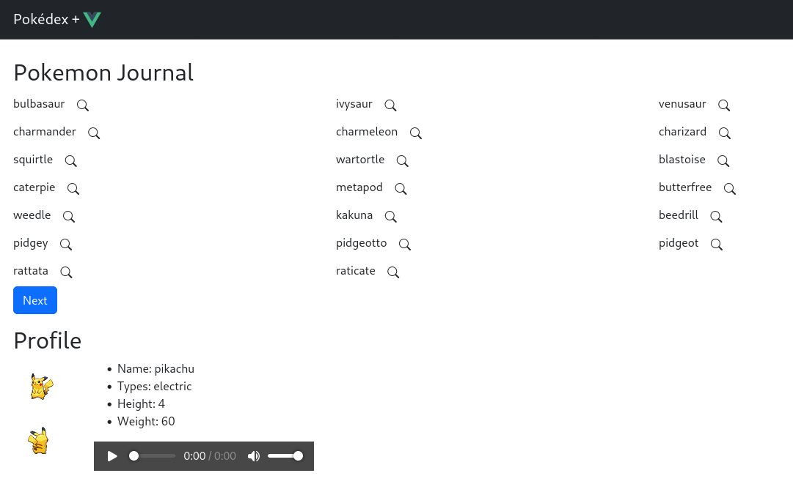

# pokedex-vue

This is a Pokédex made for fun to play with vue.js  

Thanks to [pokeapi](https://pokeapi.co/) for their free open-source RESTful API.



## Customize configuration

See [Vite Configuration Reference](https://vitejs.dev/config/).

## Project Setup

```sh
npm install
```

### Compile and Hot-Reload for Development

```sh
npm run dev
```

### Compile and Minify for Production

```sh
npm run build
```
